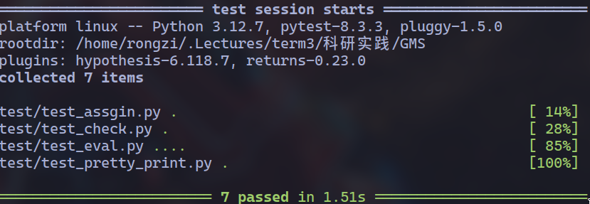
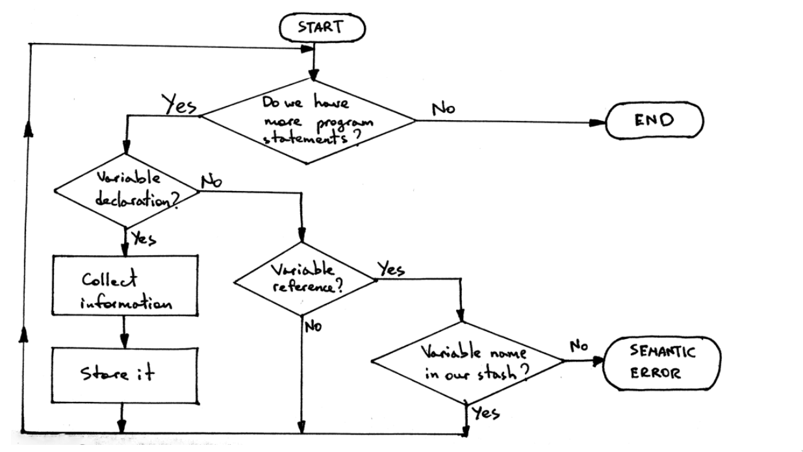

## 一、概览
最早以为这学期就能把项目做完，但越了解越觉得实现解释器复杂，背后往往有着非常抽象的理论知识，解决方案大多不唯一 //TODO
所以这学期的大部分时间都在学习解释器的基础知识，代码实现也是在这些基础上做出的实践，还未涉及实现GMS1的相关部分。
本学期学习的内容主要有：
解释器是如何工作的？
    1. tokenizer
    2. parser
    3. interpretor
        3.1. 设计模式
        3.2. 申明检查
最后，会在结尾说明未来工作的计划。


## 解释器是如何工作的？
源代码经过词法分析、语法分析和语义分析三个阶段最终被解释器解释执行。

### 词法分析

1. 在词法分析中，编译器检查源代码中是否存在非法字符，同时把合法字符组织成token，将源代码变成一个token的序列，这个过程叫做parsing。
例如，
```shell
❯ echo 'printf("hello world")' | ./tk
['printf', '(', '"hello world"', ')']

❯ echo 'fmap addone (Just 1)' | ./tk
['fmap', 'addone', '(', 'Just', '1', ')']

❯ echo '(1 + 2) * 123123 / 345345 - (123 - 321)' | ./tk
['(', '1', '+', '2', ')', '*', '123123', '/', '345345', '-', '(', '123', '-', '321', ')']

❯ echo '~@&@@!]]]@&☃``~' | ./tk
['~', '@', '&', '@', '@', '!', ']', ']', ']', '@', '&', '☃', '`', '`', '~', '\n', '']
```

2. GMS使用的词法分析器
为了简化实现(降低学习难度)，实现里面直接使用现成的python的tokenize库，它可以生成与python相同的token格式，上面实例中的`tk`程序就由该库编写。
gms将该库封装成Scanner这个class来作为词法分析器。
```python3
class Scanner:
    def scan(self):
        raise Exception('unimplemented scan method')

class StrScanner(Scanner):
    def __init__(self, buffer):
        self.buffer = buffer

    @safe
    def scan(self, encoding='utf-8'):
        return flow(
            self.buffer.encode(encoding),
            lambda bytes : BytesIO(bytes).readline,
            tokenize,
            lambda x : filter(lambda x : x.exact_type != INDENT and x.exact_type != NL, x)
        )
```


### 语法分析
语法分析这一过程会验证源代码的token是否按语法规则排列，通常产生一个ast作为后续语义分析操作的基础。

1. 上下文无关表示法(BNF)
通过这个方法可以制定语法规则，并可以方便地将规则转换成解析的代码。

一个规则大概长这样`factor : INTEGER`，冒号左侧是head，右侧是body
body中也可以出现head，能够出现在body中的head被叫做non-terminal、反之不能出现在body中的head叫做terminal。
```BNF
factor : INTEGER                         // e.g. 1、2、3、4、5
bin-tuple : LPAR factor COMMA factor RPAR    // e.g. (1, 2)、 (100, 26)、 (81, 79)
```

一个head可以被多个rule来定义，在生成表达式的时候可以任意选择一条规则。
规则中的body也可以引用自身的head，形成递归结构，比如
```BNF
factor : INTEGER
factor : MINUS   factor
factor : PLUS    factor

```

2.  (BNF)扩展语法：

除了递归语法来表示无限长的表达式，也可以使用扩展语法来定义规则，这种语法可以使用类似正则表达式的量词来修饰body中的项。
```
| 或
? 零个或一个
+ 一个或多个
* 零个或一个或多个
(...) 将括号内的全体看成是S，对该括号的修饰的量词等于对S修饰。
```
比如上面关于factor的例子可以表示成
```
// +123 -321
factor : INTEGER
        | (MINUS | PLUS) factor
```

只有算术运算的lisp表达式可以表示成
```shell
scm> (+ 13231 (- 11) (* 1 2 3 4 (+ 1234 1234 (- 4321)) ))
-5302

OP : MINUS | PLUS | MUL | DIV
lisp_expr : INTEGER
            | LPAR OP lisp_expr+ RPAR
```

3. BNF的优点
使用BNF额外的好处是可以很容易地根据定义的规则写出的识别这个规则的代码
| id | rule  | code |
| ---  | ---  | ---  |
| 1 | factor : INTEGER \| (MINUS \| PLUS) factor | def factor(self): |
| 2 | (INTEGER \| (MINUS \| PLUS) factor) | if self.token.isdigit(): else: |
| 3 | ()* | while self.token in (MUL, DIV): |
| 4 | INTEGER | assert self.token.isdigit(); self.advance() |


例如对于上面的lisp表达式，解析这个定义的代码大约如下
```python3
def read_lisp(self) -> Expr:
    assert self.curr_token == '(' or self.curr_token.isdigit()

    if self.curr_token.isdigit():        # | 
        token = self.curr_token
        self.advance()
        return Literal(token)            # INTEGER
    else:                                # (
        self.advance()
        op = self.curr_token             # OP
        factor = self.read_lisp()

        args = [factor]                  # first lisp_expr
        while self.curr_token.isdigit(): # and more
            factor = self.read_lisp()
            args.append(factor)
            self.advance()

        self.advance()                   # )

        return Expr(op, args)

```

4. 本语言中定义的语法规则
gms使用BNF的扩展形式来定义语法，主要定义了算术表达式和C语言代码块的语法形式。

4.1. 算术表达式
> gms目前只添加了整型(Num)一个类型，所以目前只能使用加减乘除四个操作符，以后应该会添加更多的操作符。
一开始我定义的语法规则如下
```BNF
OP         : PLUS | MINUS | MUL | DIV
factor     : INTEGER
arithmetic : factor (OP factor)*
```
这样定义的算术表达式默认左结合，类似`1 + 2 - 3 - 4`的表达式可以正常处理。
但是上面的定义方法并不能处理类似`1 - 2 * 3`的情况，上述语法会将这个表达式看成是`((1 - 2) * 3)`。
为了处理这种情况，为每个优先级定义一个non-terminal。non-terminal的body应该包含该级别的算术运算符和下一个更高优先级别的non-terminal。

根据上面的方法，改正上面的规则定义。
```BNF
expr: term   ((PLUS|MINUS) term)*
term: factor ((MUL | DIV) factor)*
factor: (+ | - ) factor
        | INTEGER
        | LPAR expr RPAR
```
编写一个脚本，测试算术运算的正确性
```python3
#!/usr/bin/python3
from random import randint, choice

def gen_num(n):
    return randint(0, n - 1)

def gen_oper():
    match randint(0, 3):
        case 0:
            return '+'
        case 1:
            return '-'
        case 2:
            return '*'
        case 3:
            return '/'

def gen_expr(type=0, depth=1):
    """
    type=0: primitive int
    type=1: expression with operator
    type=2: expression with parentheses
    type=3: expression with unary
    """
    if depth > 200:
        return 1
    match randint(0, 3):
        case 0:
            expr = str(randint(0, 9))
        case 1:
            expr = ''
            expr += str(gen_expr(type, depth + 1))
            expr += gen_oper()
            expr += str(gen_expr(type, depth + 1))
        case 2:
            expr = ''
            expr += '('
            expr += str(gen_expr(type, depth + 1))
            expr += ')'
        case 3:
            expr = ''
            expr += choice(['+', '-'])
            expr += str(gen_expr(type, depth + 1))
    return expr
```
实现可以正确通过eval的测试。



4.2. 语句和关键字
```BNF
assignment: variable = expr SEMI
compound statement: LBRACE statement list RBRACE
declaration statement: TYPE variable (COMMA variable)* SEMI
print statement: PRINT expr

statement: empty
            | assignment statement
            | compound statement
            | declaration statement
            | print statement

statement list: statement
            | statement   statement list

variable: NAME
```
目前还定义了更多常用的语句语法规则，并添加了一个类似python2中的print 关键字的语句方便调试。
使用了所有语法规则的一个样例如下。
print和Num为关键字
```
{
    print 1;
    print 2;

    Num a, b, c;
    a = 1;
    b = 2;
    c = 3;
    {
        Num d;
        d = a + b;
        {
            Num e;
            e = (a * b + (c  / d + 1));
            print e;
        }
        print d;
    }
    print a + c;
}
```

### 语义分析
这个步骤里解释器真正开始运行程序，解释器通常先在运行前进行类型检查、构建符号表、作用域管理等，也是GMS理论真正关注的步骤。
但在目前实现中，GMS构建了符号表，只能做基本的符号检查，计划在未来完全实现GMS的全部分析和检查。

1. 访问者模式
在语法分析后就能得到目前GMS的抽象语法树，下一步就是在其上作分析和运行，而几乎所有的语义分析阶段的工作都需要遍历这棵语法树，所以如何才能遍历这棵树是一个比较重要的问题。
在申明检查提及之前，gms只有基本的运行的功能，运行这个程序可以被看成是通过遍历这个程序的语法树过程的副作用(e.g. 输入输出，符号表、栈帧的更新等)，具体的，gms程序的执行就可以看成是识别ast节点、解释ast节点的过程。
可以为每一个分析设计各自的遍历算法，但既然不同的分析之间遍历语法树的过程都是识别ast节点，解释ast节点，那么这里就有让所有分析共用同一套遍历方法、化简代码逻辑的空间。

面向对象中的访问者模式(visitor pattern)天生适合这样的模式，根据wiki百科中的定义，我们可以根据对象结构设计不同的实在的访问者类来完成不同的操作。

为了使用这个设计模式，通常需要在申明一个抽象类Visitor，还要在遍历的数据中定义accept方法来加一层抽象，但为了简单期间，所有ast节点都没有申明accept方法，均有visitor来指定遍历顺序。

在具体实现中，gms中的一个模块nodevisitor.py中定义了一个抽象类NodeVisitor，该类申明了一个visit方法，这个方法根据节点的具体类型来选择不同的visit函数。
这使得继承自该类的任何子类都不必关心遍历ast的顺序，只需分别编写处理特定ast节点的代码即可。
```python3
class NodeVisitor:
    def visit(self, node):
        """
        reload visit functions
        visit(node: AstNode) -> Result
        """
        name = type(node).__name__
        visit_method = getattr(self, 'visit_' + name, self.generic_visit)
        return visit_method(node)

    def generic_visit(self, node):
        raise Exception(f'Not Implemented Operand Type: {type(node).__name__}')
```

负责执行程序的Evaluator这个类就是继承自上述抽象类的子类，它分别定义了处理10种节点的visit方法，并在`__init__`中定义了栈帧的简单模拟和符号表。
```python3
class Evaluater(NodeVisitor):
    def __init__(self):
    def visit_Num(self, node):
    def visit_BinOp(self, node):
    def visit_UnaryOp(self, node):
    def visit_Empty(self, node):
    def visit_Compound(self, node):
    def visit_Assign(self, node):
    def visit_Variable(self, node):
    def visit_PrintStat(self, node):
    def visit_Declaration(self, node):
    def visit_Type(self, node):
```

使用visitor 模式除了写法简单，它的另一个好处是易于扩展，在GMS项目文件夹下的prettyprint模块中，定义了ast节点上的另一种操作，该类可以较好的样式打印出gms代码，其实现与Evaluator一般简单易懂。

```python3
class PrettyPrinter(Evaluater):
    def __init__(self):
    def visit_Num(self, node):
    def visit_BinOp(self, node):
    def visit_UnaryOp(self, node):
    def visit_Variable(self, node):
    def visit_Empty(self, node):
    def visit_Compound(self, node):
    def visit_Assign(self, node):
    def visit_PrintStat(self, node):
    def visit_Declaration(self, node):
    def visit_Type(self, node):
```
nodevisitor模块下还有两个visitor子类，他们的作用分别是将算术表达式传换成Lisp样式和逆波兰表达式。


2. 申明检查
在语义分析阶段另一基本的步骤是申明检查，这也是我这学期这个项目里面最后完成的工作
当前实现的申明检查使用下面图表显示的原理，图中使用到了符号表来存储程序中出现的变量名和类型名，visitor在遍历该ast时会向符号表中查询和存入它遇见的符号。

由于申明检查也需要遍历ast，所以申明检查被实现成了nodevisitor模块中的Checker类。


## 未来的计划
由于目前的实现并未完全满足一门“能用”的语言的标准，所以关于未来的计划由两个部分组成，
1. 补足现有实现
做完最后的申明检查回头再看，这个实现还是过于简陋，只能做算术表达式，数据类型少，无函数，无指针，尤其是指针类型，这是实现GMS-1的重要一步。
计划在接下来的寒假里尽量补全这些不足。

2. 实现GMS-1和GMS-2
GMS-1需要实现一个带有所有权语义的类型系统，其中还包含指针。
而GMS-2则是需要实现两个责任分配的算法，估计需要提前实现一个异常系统作为基础，好在堆的抽象释放过的内存不再被重复使用，这一点可以大大简化实现。
这一部分则是计划下个学期内完成。
